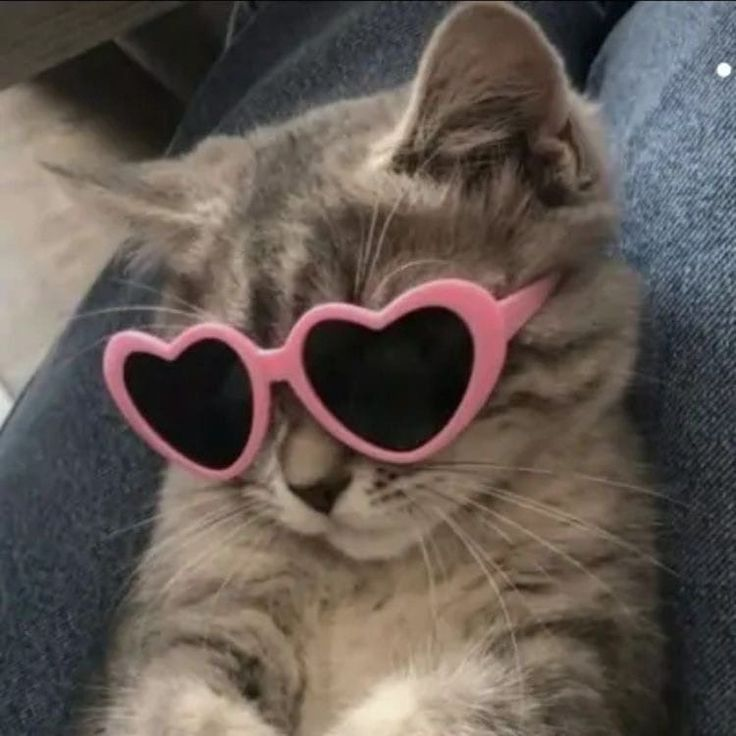

# Image steganography

This is a steganographic tool used to hide an image inside another image. Before using the tool, check `requirements.txt`.

This tool can encode an image both losslessly and lossily! But it depends on the image you're hiding it in. It needs to be big enough!

```
usage: img_steg [-h] [-i PATH] [-v] [-b NUM_OF_BITS] [-a NO_OF_PIXELS] [-o FILENAME] [-e] img1_path

Hide an image inside another image.

positional arguments:
  img1_path             Path to an image to extract a hidden image from / the visible image in which to hide another image

options:
  -h, --help            show this help message and exit
  -i PATH, --img2-path PATH
                        Path to image you'd like to hide
  -v, --verbose         Prints additional log messages
  -b NUM_OF_BITS, --bits NUM_OF_BITS
                        Number of most significant bits to use from the hidden image
  -a NO_OF_PIXELS, --advanced NO_OF_PIXELS
                        Advanced encryption; instead of hiding NUM_OF_BITS most significant bits in 1 pixel, spread it out over NO_OF_PIXELS pixels so that the change to the original image is less noticeable. If img1 resolution is big enough, it could losslessly hide img2. Max supported hidden image resolution: 262,143 x 262,143 px. Note: 8 pixels are used as a header for the encryption algorithm, so you can't have two images with the same resolutions! Not enough space!
  -o FILENAME, --output FILENAME
                        Name of the output file
  -e, --extract         Extract a hidden image

```

## Example

This is an altered image of Belgrade (the original is in `slike_za_testiranje`; try comparing them!):


And by typing this into the terminal:
`python img_steg.py OUTPUT8B8A.png -e -b 8 -a 8 -v`

We get this output:



Voilà! :)